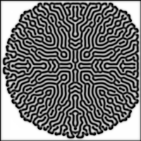

# Gray Scott's Reaction Diffusion, Implemented using Python

This project implements gray scott's reaction diffusion using python. Individual frames are calculated and generated as .png photos by using Pillow. Numpy arrays are used to store value of concentration of each chemical in each cell. To speed up the calculations, numba is also used.

### Inspiration:

[This](http://karlsims.com/rd.html) article by Karl Sims served as a tutorial / inspiration / reference for this project.

### Samples:

Here are a few samples of what this script can produce:

   

### Converting the frames to video:

ffmpeg is used to convert the generated frames into a video (.mp4):

`ffmpeg -r {frame_rate} -f image2 -s {resolution} -i pic%04d.png -vcodec libx264 -crf 25  -pix_fmt yuv420p output.mp4`

### Pygame Version:

A pygame version is also included, for those who don't want to generate individual frames but change the simulation parameters (like kill and feed rate) and experiment with different patterns that emerge. Although in my computer(Intel i5 650, 8 Gb RAM), anything beyond 300x300 resolution is painfully slow.
